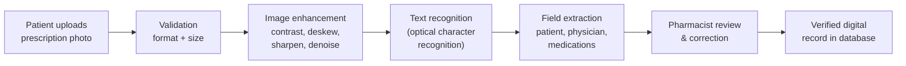

# Mediseena OCR Pipeline — Panel Handout
## From Prescription Photo to Structured Digital Record (Methodology Reference)

> Companion to the technical specification in `ocr-pipeline.md`.
> This handout describes the same pipeline in defense-ready language,
> mapped to the thesis methodology chapters. No implementation detail below
> is required to follow the argument.

## 1. Problem and approach (Sections 1–3.4)

Handwritten prescriptions are misread because raw photographs are noisy and
unstructured. Mediseena therefore never sends a raw photo directly to text
recognition. Every upload passes through four gates — **validation,
enhancement, recognition, and human verification** — so that machine output is
always confirmed before it becomes a medical record.

## 2. Pipeline stages (Sections 3.7.1–3.7.3)

| Stage (methodology) | What happens | Why it matters |
|---|---|---|
| File validation (3.4.2) | Only JPG, PNG, WebP, or PDF files up to 10 MB are accepted; anything else is rejected with an explanation | Guarantees the pipeline only spends computation on legible, supported inputs |
| Canvas preprocessing (3.7.1) | The user adjusts contrast, brightness, rotation (deskew), grayscale, binarization, sharpening, and noise reduction on a live before/after preview, aided by clinical presets for handwriting and print | Handwriting varies in ink, angle, and lighting; enhancement lifts recognition accuracy toward the ≥ 85% benchmark |
| Readability gate (3.7.1) | A contrast-range measure rejects blank or near-blank scans before recognition runs | Prevents wasted processing and meaningless output |
| Optical character recognition (3.7.2) | An on-device recognition engine reads the enhanced image into raw text with a confidence score | Runs entirely in the browser, so no patient image must leave the device at this stage |
| Clinical field extraction (3.7.2) | The raw text — and, when available, the image — is mapped to patient details, physician details, issue date, and a medication list with per-field confidence | Free text becomes queryable, structured medical data |
| Mandatory human verification (3.7.3) | A pharmacist reviews every field against the scan image, corrects discrepancies, and confirms the record | No machine output enters the repository unverified; every correction is logged |
| Storage and audit (3.8) | The confirmed record is stored with `pending` status until verified, alongside correction and audit entries | Full traceability from scan to verified record |

## 3. Three-tier extraction strategy (Section 3.6)

Field extraction degrades gracefully across connectivity and configuration levels:

1. **Secure server inference (preferred).** The image and raw text are sent to a
   server-side function that calls the vision-language model with the
   credential held only on the server — the secret is never exposed to the browser.
2. **Direct model call.** Where a project API key is configured on the client,
   the application calls the vision model directly.
3. **On-device fallback.** With no connectivity or key, a built-in clinical
   pattern engine extracts the same fields locally, so the pipeline always
   produces an editable draft for review.

In all three tiers the output contract is identical — patient, physician,
prescription metadata, and medications with confidence scores — so downstream
review and storage behave the same regardless of tier.

## 4. Data integrity and role separation (Sections 3.3, 3.8)

- **Patients** upload scans and view their own verified records and exports.
- **Pharmacists / healthcare workers** review machine output, correct fields,
  and confirm verification; each change is written to a correction log with
  the original and corrected values.
- **Administrators** monitor system health and audit trails; they do not edit
  clinical content.
- Records enter the database as `pending` and only become trusted data upon
  pharmacist confirmation.

## 5. Evaluation linkage (Sections 3.1.1, 3.5.2)

The pipeline emits the measurements the study evaluates:

- **OCR field accuracy (≥ 85%)** — extracted fields minus logged corrections,
  over extracted fields.
- **Manual correction rate (≤ 15%)** — proportion of records the pharmacist
  had to amend, drawn directly from the correction log.
- **Average processing time (≤ 10 s)** — measured end-to-end from upload
  through extraction.
- **Successful digitization rate (≥ 95%)** — verified records over uploads.
- **Workflow completion (≥ 90%)** — uploads that reach a saved record.

## 6. Live demonstration script (≈ 5 minutes)

1. Open the upload page and submit a prescription photo (or drag it onto the scan card).
2. Adjust one enhancement control and point out the before/after preview and readability indicator.
3. Proceed to extraction; narrate the progress states from recognition to field mapping.
4. On the review screen, correct one field and note the correction counter.
5. Confirm the record; show it in the repository and export it as JSON or PDF.
6. Open the KPI view to show where the correction just logged itself.

## 7. Anticipated questions

- *What if the handwriting is illegible?* The readability gate warns before
  recognition; the reviewer flags ambiguous fields, and the log records it.
- *What if the AI service is unreachable?* The on-device fallback still
  produces a structured draft, and review proceeds unchanged.
- *Where is patient data stored?* In the project database (or the local
  demonstration store in offline mode); recognition itself runs on-device.
- *How do you know accuracy claims hold?* Every pharmacist correction is a
  logged data point feeding the accuracy and correction-rate metrics above.
