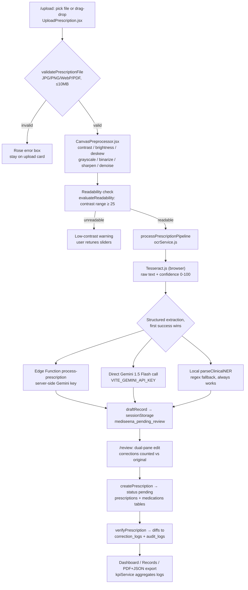

# Mediseena OCR Pipeline — From Upload to Structured Data

> How a prescription photo becomes structured data when a user uploads it.
> Audience: thesis panel (methodology traceability) + developers (code entry points).
> Code refs are `frontend/src/…` unless noted; line numbers verified at time of writing.

## 1. Overview

A user uploads a prescription on `/upload`. The image never goes straight to OCR:
it is **validated → preprocessed on a canvas → OCR'd in the browser → mapped to
clinical fields by AI (or a local fallback) → parked in `sessionStorage` →
human-reviewed → saved as a `pending` record → pharmacist-verified**. Every
correction is logged, and those logs feed the research KPIs.



## 2. Stage table

| # | Stage | Entry point | Input | Output | Knobs / config |
|---|-------|-------------|-------|--------|----------------|
| 0 | Capture | `pages/UploadPrescription.jsx:63` `handleFileSelection`, `:80` `handleDrop` | `File` (picker or drop) | data-URL preview + staged chip; bottom Upload enables | `accept="image/jpeg,image/png,image/webp,application/pdf"` |
| 1 | Validation | `utils/validators.js:14` `validatePrescriptionFile` | `File` | `{valid, error?}` | `ACCEPTED_IMAGE_TYPES`, `MAX_FILE_SIZE_BYTES` = 10 MB |
| 2 | Preprocessing | `components/upload/CanvasPreprocessor.jsx:23`, engine `utils/imagePreprocessor.js:90` `preprocessCanvas` | image source + slider state | processed data URL + `readability` | contrast/brightness/rotation, grayscale, binarize+threshold, sharpen, denoise; presets: handwriting, printed_binary, despeckle, reset (`CanvasPreprocessor.jsx:89`) |
| 3 | Readability gate | `utils/imagePreprocessor.js:37` `evaluateReadability` | `ImageData` | `{readable, contrastScore}` — blank/low-contrast (`range < 25`) rejected | UI badge only; user retunes, nothing is discarded server-side |
| 4 | OCR | `services/ocrService.js:15` `runTesseractOCR` | processed data URL | `{text, confidence, words[{text, confidence, bbox}], durationMs}` | `createWorker('eng')`; progress 0.1 → 0.7 surfaces in overlay |
| 5a | NER via Edge Function (preferred) | `services/ocrService.js:260`, `supabase/functions/process-prescription/index.ts:22` | `{imageBase64, ocrText, ocrConfidence}` | `{success, data, processing_time_ms}` — strict patient/physician/medications JSON schema (`index.ts:62`) | `GEMINI_API_KEY` in Edge Function secrets; model `gemini-1.5-flash`, `temperature: 0.1` |
| 5b | NER via direct Gemini | `services/ocrService.js:275` `callDirectGeminiVision` | same + client key | parsed JSON or `null` | `VITE_GEMINI_API_KEY` or `localStorage.mediseena_gemini_api_key` |
| 5c | NER local fallback | `services/ocrService.js:69` `parseClinicalNER` | raw text + OCR confidence | same JSON shape, regex-derived + safe defaults | flags `is_flagged` when confidence < 80; seeds one Amoxicillin row if no meds found |
| 6 | Handoff | `pages/UploadPrescription.jsx:95` `handleProceedToOCR` | pipeline result | `sessionStorage.mediseena_pending_review = {draft, originalExtraction, meta}` → redirect `/review` | draft defaults (e.g. `Juan Dela Cruz`) only fill gaps the extractor missed |
| 7 | Review & verify | `pages/ReviewExtraction.jsx:39` load, `:89` field edits, `:139` via service | draft + original | `createPrescription` (status `pending`) then `verifyPrescription` → `correction_logs` + `audit_logs` | `validatePrescriptionRecord` (`validators.js:46`) gates verify: patient/physician/date + ≥1 medication with name + dosage |
| 8 | Consume | `hooks/usePrescriptions.js:9`, `services/kpiService.js`, `services/exportService.js:13,71` | stored records + logs | dashboard/records UI, JSON + jsPDF export, live KPI cards | Supabase live when `VITE_SUPABASE_URL/KEY` set, else localStorage seed mode (`api.js:11`) |

## 3. Data shapes

### 3.1 Structured NER object (Edge Function ⇄ local fallback — same contract)

```jsonc
{
  "patient":     { "name": "string", "age": 42, "gender": "Male", "address": "…", "confidence": 92 },
  "physician":   { "name": "Dr. …", "license": "PRC-…", "clinic": "…", "confidence": 90 },
  "prescription":{ "date_issued": "YYYY-MM-DD", "notes": "…" },
  "medications": [{ "medication_name": "Amoxicillin", "generic_name": "…",
                    "dosage": "500 mg", "frequency": "Every 8 hours (3x daily)",
                    "duration": "7 days", "route": "Oral",
                    "instructions": "…", "confidence_score": 88, "flag_warning": null }],
  "overall_confidence": 90.5
}
```

Schema enforced by the Edge Function prompt (`supabase/functions/process-prescription/index.ts:62`);
the local fallback returns the identical shape (`services/ocrService.js:215`).

### 3.2 Pipeline result → draft handoff

`processPrescriptionPipeline` (`services/ocrService.js:243`) returns
`{rawOcrText, ocrConfidence, tesseractTimeMs, totalProcessingTimeMs,
edgeFunctionUsed, structured}`. The upload page flattens `structured` into the
flat draft record (`pages/UploadPrescription.jsx:106`) — `patient_name`,
`physician_name/license`, `clinic_hospital`, `date_issued`, `medications[]` —
plus provenance (`raw_ocr_text`, `ocr_confidence`, `ai_confidence`,
`processing_time_ms`, `source_image_url` = processed data URL).

### 3.3 Database rows (`supabase/schema.sql`)

| Table (line) | Written when | Key columns from OCR |
|---|---|---|
| `prescriptions` (`schema.sql:62`) | `createPrescription` | patient/physician/clinic/date, `raw_ocr_text`, `ocr_confidence`, `ai_confidence`, `processing_time_ms`, `verification_status='pending'` |
| `medications` (`schema.sql:91`) | with the prescription | name, generic, dosage, frequency, duration, route, instructions, `confidence_score` |
| `correction_logs` (`schema.sql:107`) | `verifyPrescription` diffs | `field_name`, `original_value`, `corrected_value` per changed field |
| `audit_logs` (`schema.sql:119`) | upload + verify actions | `PRESCRIPTION_UPLOAD`, verification events |
| `kpi_metrics` (`schema.sql:134`) | KPI snapshots | aggregates consumed by `kpiService` |

## 4. Config matrix — which path actually runs

| Environment | OCR | NER branch | Storage |
|---|---|---|---|
| No env keys (offline demo) | Tesseract.js, browser | 5c local `parseClinicalNER` | localStorage seeds (`api.js:11` `isLiveSupabaseConfigured=false`) |
| `VITE_GEMINI_API_KEY` only | Tesseract.js | 5b direct Gemini, else 5c | localStorage |
| Supabase URL/KEY + Edge secret `GEMINI_API_KEY` | Tesseract.js | 5a Edge Function, else 5b/5c | Supabase Postgres + Storage |
| Edge deployed, secret missing | Tesseract.js | Edge returns `{fallback:true}` (`index.ts:34`) → 5b/5c | depends on client keys |

## 5. Failure behavior (nothing silently drops data)

- Bad type/size → inline rose error, pipeline never starts (`UploadPrescription.jsx:298`).
- Blank/low-contrast scan → readability badge warns; user adjusts sliders or re-uploads.
- `runTesseractOCR` throw → overlay closes, error message, preprocessing view restored (`UploadPrescription.jsx:136`).
- Edge/Gemini failure → caught, `console.warn`, automatic NER fallback (`ocrService.js:283`); `edgeFunctionUsed=false` recorded in handoff `meta`.
- NER finds nothing → safe seeded defaults (patient/physician + one medication row) so review always has an editable draft.

## 6. KPI hooks (Sections 3.1.1 / 3.5.2)

- **OCR field accuracy ≥ 85%** — `(extracted − corrections) / extracted`, corrections = `correction_logs` rows.
- **Manual correction rate ≤ 15%** — share of records with ≥1 log row.
- **Avg processing time ≤ 10 s** — `processing_time_ms` end-to-end (upload → NER done).
- **Digitization rate ≥ 95%** — verified records / total uploads; **completion ≥ 90%** — upload→save retention.

## 7. End-to-end test walkthrough

1. `npm run dev` in `frontend/`, open `/upload`.
2. Drop a prescription photo → staged chip appears, bottom Upload activates.
3. Click Upload → tune sliders (try Handwriting Enhance) → Proceed to OCR.
4. Watch overlay statuses (Tesseract % → Gemini/NER → complete) → lands on `/review` with extracted fields.
5. Edit one field → corrections counter increments → Verify & Confirm.
6. Check `/records` (new `pending`→ verified row), `/records/:id` (JSON/PDF export), `/kpis` (logs reflected).
